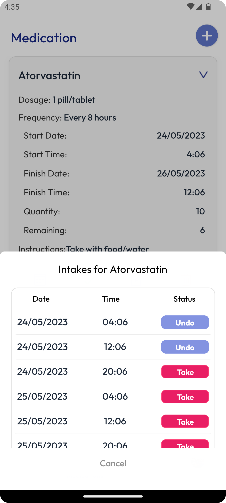

<!-- BUILT WITH -->


<!-- TABLE OF CONTENTS -->
<details>
  <summary>Table of Contents</summary>
  <ol>
    <li>
      <a href="#todaymeds">About The Project</a>
      <ul>
        <li><a href="#built-with">Built With</a></li>
      </ul>
    </li>
    <li>
      <a href="#getting-started">Getting Started</a>
      <ul>
        <li><a href="#prerequisites">Prerequisites</a></li>
        <li><a href="#installation">Installation</a></li>
      </ul>
    </li>
    <li><a href="#features">Features</a></li>
    <li><a href="#roadmap">Roadmap</a></li>
    <li><a href="#contributing">Contributing</a></li>
    <li><a href="#license">License</a></li>
    <li><a href="#contact">Contact</a></li>
    <li><a href="#acknowledgments">Acknowledgments</a></li>
  </ol>
</details>

<!-- PROJECT LOGO -->
<br />
<div align="center" >
   <a href="#todaymeds">
       
   </a>
</div>

# About The Project

TodayMeds is a mobile application developed using React Native with Firebase, done as the final project. It's a simple medication reminder app that helps users manage their medications more effectively. 

## Features

- User registration and login.
- Medication management: Add, edit, delete medications.
- Reminder: You get a notification when it's time to take the medicine.
- Medication history: View past medication usage.
- Firebase Integration: Description of how Firebase is used (e.g., authentication, database).

## Technology Stack

- Agile development methodology
- React Native
- TypeScript
- Expo SDK
- Firebase Authentication and Database (for user management and data storage)

## Instructions to run the app

1. **Clone the repository:**
   ```bash
   git clone https://github.com/lima8002/TodayMeds.git
   cd TodayMeds
   ```

2. Install dependencies

   ```bash
   npm install
   ```

3. Set up Firebase configuration:

   Create a ``FirebaseCredentials.ts`` file in the ``utils`` directory with your Firebase Web project settings:
   ```typescript
   import { FirebaseOptions } from "firebase/app";

   export const firebaseConfig: FirebaseOptions = {
      apiKey: "YOUR_API_KEY",
      authDomain: "YOUR_AUTH_DOMAIN",
      projectId: "YOUR_PROJECT_ID",
      storageBucket: "YOUR_STORAGE_BUCKET",
      messagingSenderId: "YOUR_MESSAGING_SENDER_ID",
      appId: "YOUR_APP_ID",
      measurementId: "YOUR_MEASUREMENT_ID"
    };
   ```
   If you need help setting up the web project, you can check the official documentation from Firebase

   - [Configure Firebase Web Project](https://firebase.google.com/docs/web/setup)

   
5. Start the app

   The app needs to run on a development build with these commands below:
   ```bash
   # Android
    npx expo run:android
   
   # iOS (Mac only)
    npx expo run:ios
   ```

   In case of any problems, you'll find the official documentation below from Expo
   
   - [Development build](https://docs.expo.dev/develop/development-builds/introduction/)
   - [Android emulator](https://docs.expo.dev/workflow/android-studio-emulator/)
   - [iOS simulator](https://docs.expo.dev/workflow/ios-simulator/)
   - [Expo Go](https://expo.dev/go)

## App screens

Android:
<div align="text-align: justify;"  >
   <a href="#todaymeds">
     &nbsp;
     &nbsp;
     &nbsp;
     
   </a>
</div>
<br/>

<p align="center">

</p>


iOS:
<div align="center" >
   <a href="#todaymeds">
     &nbsp;
     &nbsp;
     &nbsp;
     
   </a>
</div>

## Developer

The project was done by Eduardo Lima at [AIT - Academy of Interactive Technology](https://ait.edu.au/), Sydney campus, Australia.

<br/>
